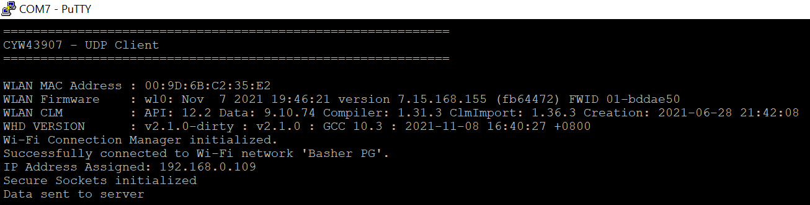
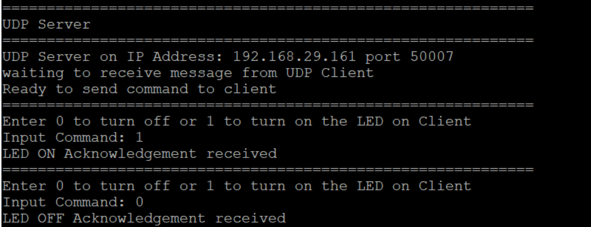
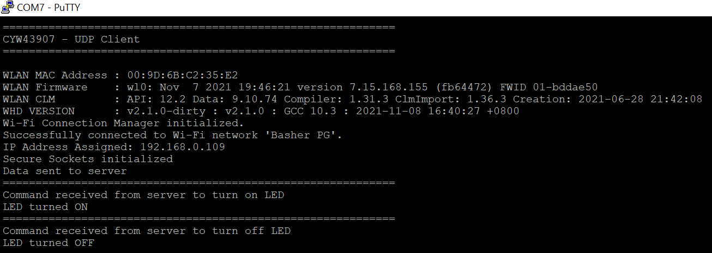

# AIROC&trade; CYW43907 UDP Client

This code example demonstrates the implementation of a UDP client with AIROC&trade; CYW43907 MCU. The example establishes a connection with a remote UDP server, and based on the command received from the UDP server, turns the user LED ON or OFF.

This example uses the [Wi-Fi Middleware Core](https://github.com/Infineon/wifi-mw-core) library of the Connectivity SDK. This library enables Wi-Fi-based application development by bundling together various other libraries - FreeRTOS, Wi-Fi Host Driver (WHD), lwIP, and Cypress Secure Sockets. The Cypress Secure Sockets library provides an easy-to-use API by abstracting the network stack (lwIP).

[View this README on GitHub.](https://github.com/Infineon/mtb-example-cyw43907-udp-client)

[Provide feedback on this code example.](https://cypress.co1.qualtrics.com/jfe/form/SV_1NTns53sK2yiljn?Q_EED=eyJVbmlxdWUgRG9jIElkIjoiQ0UyMzQwOTUiLCJTcGVjIE51bWJlciI6IjAwMi0zNDA5NSIsIkRvYyBUaXRsZSI6IkFJUk9DJnRyYWRlOyBDWVc0MzkwNyBVRFAgQ2xpZW50IiwicmlkIjoicm95ZyIsIkRvYyB2ZXJzaW9uIjoiMS4wLjAiLCJEb2MgTGFuZ3VhZ2UiOiJFbmdsaXNoIiwiRG9jIERpdmlzaW9uIjoiTUNEIiwiRG9jIEJVIjoiSUNXIiwiRG9jIEZhbWlseSI6IldJRkkifQ==)

## Requirements

- [ModusToolbox&trade; software](https://www.cypress.com/products/modustoolbox-software-environment) v2.4 or later (tested with v2.4)
- Board Support Package (BSP) minimum required version: 0.5.0
- Programming Language: C
- Associated Parts:
- [AIROC&trade; CYW43907 embedded wireless SoC ](https://www.cypress.com/file/298236/download)


## Supported toolchains (make variable 'TOOLCHAIN')

- GNU Arm® Embedded Compiler v10.3.1 (`GCC_ARM`) - Default value of `TOOLCHAIN`

## Supported kits (make variable 'TARGET')

- [AIROC&trade; CYW43907 Embedded Wireless SoC kit](https://community.cypress.com/t5/Public-Archive/CYW43907-CYW54907-Product-Guide/m-p/251047) (`CYW943907AEVAL1F`) – Default value of `TARGET`

## Hardware setup

This example uses the board's default configuration. See the kit user guide to ensure that the board is configured correctly.


## Software setup

- Install a terminal emulator if you do not have one. Instructions in this document use [PuTTY](https://www.putty.org/).

- Install a Python Interpreter if you do not have one. This code example is tested with [Python 3.7.7](https://www.python.org/downloads/release/python-377/).

## Using the code example

Create the project and open it using one of the following:

<details><summary><b>In Eclipse IDE for ModusToolbox&trade; software</b></summary>

1. Click the **New Application** link in the **Quick Panel** (or use **File** > **New** > **ModusToolbox Application**). This launches the [Project Creator](http://www.cypress.com/ModusToolboxProjectCreator) tool.

2. Pick a kit supported by the code example from the list shown in the **Project Creator - Choose Board Support Package (BSP)** dialog.

   When you select a supported kit, the example is reconfigured automatically to work with the kit. To work with a different supported kit, use the [Library Manager](https://www.cypress.com/ModusToolboxLibraryManager) to choose the BSP for the supported kit. You can use the Library Manager to select or update the BSP and firmware libraries used in this application. To access the Library Manager, click the link from the **Quick Panel**.

   You can also start the application creation process again and select a different kit.

   If you want to use the application for a kit not listed here, you may need to update the source files. If the kit does not have the required resources, the application may not work.

3. In the **Project Creator - Select Application** dialog, choose the example by enabling the checkbox.

4. Optionally, change the suggested **New Application Name**.

5. Enter the local path in the **Application(s) Root Path** field to indicate where the application needs to be created.

   Applications that can share libraries can be placed in the same root path.

6. Click **Create** to complete the application creation process.

For more details, see the [Eclipse IDE for ModusToolbox&trade; software user guide](https://www.cypress.com/MTBEclipseIDEUserGuide) (locally available at *{ModusToolbox install directory}/ide_{version}/docs/mt_ide_user_guide.pdf*).

</details>

<details><summary><b>In command-line interface (CLI)</b></summary>

ModusToolbox&trade; software provides the Project Creator as both a GUI tool and the command line tool, "project-creator-cli". The CLI tool can be used to create applications from a CLI terminal or from within batch files or shell scripts. This tool is available in the *{ModusToolbox&trade; software install directory}/tools_{version}/project-creator/* directory.

Use a CLI terminal to invoke the "project-creator-cli" tool. On Windows, use the command line "modus-shell" program provided in the ModusToolbox&trade; software installation instead of a standard Windows command-line application. This shell provides access to all ModusToolbox&trade; software tools. You can access it by typing `modus-shell` in the search box in the Windows menu. In Linux and macOS, you can use any terminal application.

This tool has the following arguments:

Argument | Description | Required/optional
---------|-------------|-----------
`--board-id` | Defined in the `<id>` field of the [BSP](https://github.com/Infineon?q=bsp-manifest&type=&language=&sort=) manifest | Required
`--app-id`   | Defined in the `<id>` field of the [CE](https://github.com/Infineon?q=ce-manifest&type=&language=&sort=) manifest | Required
`--target-dir`| Specify the directory in which the application is to be created if you prefer not to use the default current working directory | Optional
`--user-app-name`| Specify the name of the application if you prefer to have a name other than the example's default name | Optional

<br>

The following example will clone the "[Hello World](https://github.com/Infineon/mtb-example-cyw43907-hello-world)" application with the desired name "MyHelloWorld" configured for the *CYW943907AEVAL1F* BSP into the specified working directory, *C:/mtb_projects*:

   ```
   project-creator-cli --board-id CYW943907AEVAL1F --app-id mtb-example-cyw43907-hello-world --user-app-name MyHelloWorld --target-dir "C:/mtb_projects"
   ```

**Note:** The project-creator-cli tool uses the `git clone` and `make getlibs` commands to fetch the repository and import the required libraries. For details, see the "Project creator tools" section of the [ModusToolbox&trade; software user guide](https://www.cypress.com/ModusToolboxUserGuide) (locally available at *{ModusToolbox&trade; software install directory}/docs_{version}/mtb_user_guide.pdf*).

</details>

<details><summary><b>In third-party IDEs</b></summary>

1. Follow the instructions from the **In command-line interface (CLI)** section to create the application, and import the libraries using the `make getlibs` command.

2. Export the application to a supported IDE using the `make <ide>` command.

   For a list of supported IDEs and more details, see the "Exporting to IDEs" section of the [ModusToolbox&trade; software user guide](https://www.cypress.com/ModusToolboxUserGuide) (locally available at *{ModusToolbox install directory}/docs_{version}/mtb_user_guide.pdf*.

3. Follow the instructions displayed in the terminal to create or import the application as an IDE project.

</details>

## Operation

1. Connect the board to your PC using the provided USB cable through the micro-USB connector.

2. Modify the `WIFI_SSID`, `WIFI_PASSWORD`, and `WIFI_SECURITY_TYPE` macros to match the credentials of the Wi-Fi network that you want to connect. These macros are defined in the *udp_client.h* file. Ensure that the Wi-Fi network that you are connecting to is configured as a private network for the proper functioning of this example.

3. Ensure your computer is connected to the same Wi-Fi access point that you have configured in step 2.

4. Determine the computer's IP address.

   To determine the IP address, type the following command in the command shell based on your operating system:

   - Windows: `ipconfig`

   - Linux: `curl ifconfig.me`

   - macOS: `ifconfig |grep inet`


5. Change the `UDP_SERVER_IP_ADDRESS` macro defined in the *udp_client.h* file to match with the computer's IP address. For example, if your computer's IP address is
   192.168.1.107, then update the macro as shown below:

   ```
   #define UDP_SERVER_IP_ADDRESS             MAKE_IPV4_ADDRESS(192, 168, 1, 107)
   ```

6. Open a terminal program and select the appropriate COM port. Set the serial port parameters to 8N1 and 115200 baud.

7. Ensure that the Python interpreter (see [Software Setup](#software-setup)) is installed on your computer.

8. Open a command shell from the project directory and run the Python UDP server (*udp_server.py*).  In the command shell opened in the project directory, type in the following command:

   ```
   python udp_server.py
   ```

   **Note:** Ensure that the firewall settings of your computer allow access to the Python software so that it can communicate with the UDP client. For more details on enabling Python access, see this [community thread](https://community.cypress.com/thread/53662).

9. Program the board.

   <details><summary><b>Using Eclipse IDE for ModusToolbox&trade; software</b></summary>

      1. Select the application project in the Project Explorer.

      2. In the **Quick Panel**, scroll down, and click **\<Application Name> Program (FTDI)**.
      </details>

   <details><summary><b>Using CLI</b></summary>

     From the terminal, execute the `make program` command to build and program the application using the default toolchain to the default target. You can specify a target and toolchain manually:
      ```
      make program TARGET=<BSP> TOOLCHAIN=<toolchain>
      ```

      Example:
      ```
      make program TARGET=CYW943907AEVAL1F TOOLCHAIN=GCC_ARM
      ```
   </details>

   After programming, the application starts automatically. Confirm that the text shown in Figure 1 is displayed on the UART terminal. Note that Wi-Fi SSID and the IP address assigned will be different based on the network that you have connected to.

   **Figure 1. UART Terminal Showing the Wi-Fi Connectivity Status**

   

10. From the Python UDP server, send the command to turn the LED ON or OFF to the UDP client ('0' to turn the LED OFF and '1' to turn ON). Observe the user LED (CYBSP_USER_LED2) turning ON/OFF on the board.

    **Figure 2. UDP Server Output**

    

    **Figure 3. LED Status on UDP Client**

    

**Note:** Instead of using the Python UDP server (*udp_server.py*), you can use the example [mtb-example-cyw43907-udp-server](https://github.com/Infineon/mtb-example-cyw43907-udp-server) to run as the UDP server on a second kit. See the code example documentation to learn how to use the example. If you are using the example as the server, the IP address (`UDP_SERVER_IP_ADDRESS`) configured in **Step 5** of the [Operation](#operation) section should be that of the IP address assigned to the kit in the example.

## Debugging

You can debug the example to step through the code. In the IDE, use the **\<Application Name> Debug (FTDI)** configuration in the **Quick Panel**. For more details, see the "Program and debug" section in the [Eclipse IDE for ModusToolbox&trade; software user guide](https://www.cypress.com/MTBEclipseIDEUserGuide).

## Design and implementation

### Resources and settings

**Table 1. Application resources**

| Resource   |  Alias/object    |    Purpose    |
| :-------   | :------------    | :------------ |
| SDIO (HAL) | sdio_obj | SDIO interface for Wi-Fi connectivity |
| UART (HAL) |cy_retarget_io_uart_obj| UART HAL object used by Retarget-IO for Debug UART port |
| LED (BSP)  | CYBSP_USER_LED2 | User LED to show output |

In this example, AIROC&trade; CYW43907 MCU is configured as a UDP client, which establishes a connection with a remote UDP server, and based on the command received from the UDP Server, turns the user LED (CYBSP_USER_LED2) ON or OFF.

## Related resources

Resources  | Links
-----------|----------------------------------
Code examples  | [Using ModusToolbox&trade; software](https://github.com/Infineon/Code-Examples-for-ModusToolbox-Software) on GitHub <br> 
Device documentation | [AIROC&trade; CYW43907 datasheet](https://www.cypress.com/file/298236/download) <br> 
Development kits | Visit www.cypress.com/microcontrollers-mcus-kits and use the options in the **Select your kit** section to filter kits by *Product family* or *Features*.
Libraries on GitHub  | [mtb-hal-cat4](https://github.com/infineon/mtb-hal-cat4) – AIROC&trade; CYW43907 Hardware abstraction layer (HAL) library <br> [retarget-io](https://github.com/infineon/retarget-io) – Utility library to retarget STDIO messages to a UART port <br>  
Tools  | [Eclipse IDE for ModusToolbox&trade; software](https://www.cypress.com/modustoolbox) – ModusToolbox&trade; software is a collection of easy-to-use software and tools enabling rapid development with Infineon MCUs, covering applications from embedded sense and control to wireless and cloud-connected systems using AIROC&trade; Wi-Fi and Bluetooth® connectivity devices. <br> 

<br>

## Other resources

Cypress provides a wealth of data at www.cypress.com to help you select the right device, and quickly and effectively integrate it into your design.

## Document history

Document title: *CE234095* - *AIROC&trade; CYW43907 UDP Client*

| Version | Description of change |
| ------- | --------------------- |
| 1.0.0   | New code example      |

<br>

------

© Cypress Semiconductor Corporation (An Infineon Technologies Company), 2021. This document is the property of Cypress Semiconductor Corporation and its affiliates ("Cypress"). This document, including any software or firmware included or referenced in this document ("Software"), is owned by Cypress under the intellectual property laws and treaties of the United States and other countries worldwide. Cypress reserves all rights under such laws and treaties and does not, except as specifically stated in this paragraph, grant any license under its patents, copyrights, trademarks, or other intellectual property rights. If the Software is not accompanied by a license agreement and you do not otherwise have a written agreement with Cypress governing the use of the Software, then Cypress hereby grants you a personal, non-exclusive, nontransferable license (without the right to sublicense) (1) under its copyright rights in the Software (a) for Software provided in source code form, to modify and reproduce the Software solely for use with Cypress hardware products, only internally within your organization, and (b) to distribute the Software in binary code form externally to end users (either directly or indirectly through resellers and distributors), solely for use on Cypress hardware product units, and (2) under those claims of Cypress's patents that are infringed by the Software (as provided by Cypress, unmodified) to make, use, distribute, and import the Software solely for use with Cypress hardware products. Any other use, reproduction, modification, translation, or compilation of the Software is prohibited.  
TO THE EXTENT PERMITTED BY APPLICABLE LAW, CYPRESS MAKES NO WARRANTY OF ANY KIND, EXPRESS OR IMPLIED, WITH REGARD TO THIS DOCUMENT OR ANY SOFTWARE OR ACCOMPANYING HARDWARE, INCLUDING, BUT NOT LIMITED TO, THE IMPLIED WARRANTIES OF MERCHANTABILITY AND FITNESS FOR A PARTICULAR PURPOSE. No computing device can be absolutely secure. Therefore, despite security measures implemented in Cypress hardware or software products, Cypress shall have no liability arising out of any security breach, such as unauthorized access to or use of a Cypress product. CYPRESS DOES NOT REPRESENT, WARRANT, OR GUARANTEE THAT CYPRESS PRODUCTS, OR SYSTEMS CREATED USING CYPRESS PRODUCTS, WILL BE FREE FROM CORRUPTION, ATTACK, VIRUSES, INTERFERENCE, HACKING, DATA LOSS OR THEFT, OR OTHER SECURITY INTRUSION (collectively, "Security Breach"). Cypress disclaims any liability relating to any Security Breach, and you shall and hereby do release Cypress from any claim, damage, or other liability arising from any Security Breach. In addition, the products described in these materials may contain design defects or errors known as errata which may cause the product to deviate from published specifications. To the extent permitted by applicable law, Cypress reserves the right to make changes to this document without further notice. Cypress does not assume any liability arising out of the application or use of any product or circuit described in this document. Any information provided in this document, including any sample design information or programming code, is provided only for reference purposes. It is the responsibility of the user of this document to properly design, program, and test the functionality and safety of any application made of this information and any resulting product. "High-Risk Device" means any device or system whose failure could cause personal injury, death, or property damage. Examples of High-Risk Devices are weapons, nuclear installations, surgical implants, and other medical devices. "Critical Component" means any component of a High-Risk Device whose failure to perform can be reasonably expected to cause, directly or indirectly, the failure of the High-Risk Device, or to affect its safety or effectiveness. Cypress is not liable, in whole or in part, and you shall and hereby do release Cypress from any claim, damage, or other liability arising from any use of a Cypress product as a Critical Component in a High-Risk Device. You shall indemnify and hold Cypress, its directors, officers, employees, agents, affiliates, distributors, and assigns harmless from and against all claims, costs, damages, and expenses, arising out of any claim, including claims for product liability, personal injury or death, or property damage arising from any use of a Cypress product as a Critical Component in a High-Risk Device. Cypress products are not intended or authorized for use as a Critical Component in any High-Risk Device except to the limited extent that (i) Cypress's published data sheet for the product explicitly states Cypress has qualified the product for use in a specific High-Risk Device, or (ii) Cypress has given you advance written authorization to use the product as a Critical Component in the specific High-Risk Device and you have signed a separate indemnification agreement.  
Cypress, the Cypress logo, Spansion, the Spansion logo, and combinations thereof, WICED, PSoC, CapSense, EZ-USB, F-RAM, and Traveo are trademarks or registered trademarks of Cypress in the United States and other countries. For a more complete list of Cypress trademarks, visit cypress.com. Other names and brands may be claimed as property of their respective owners.
